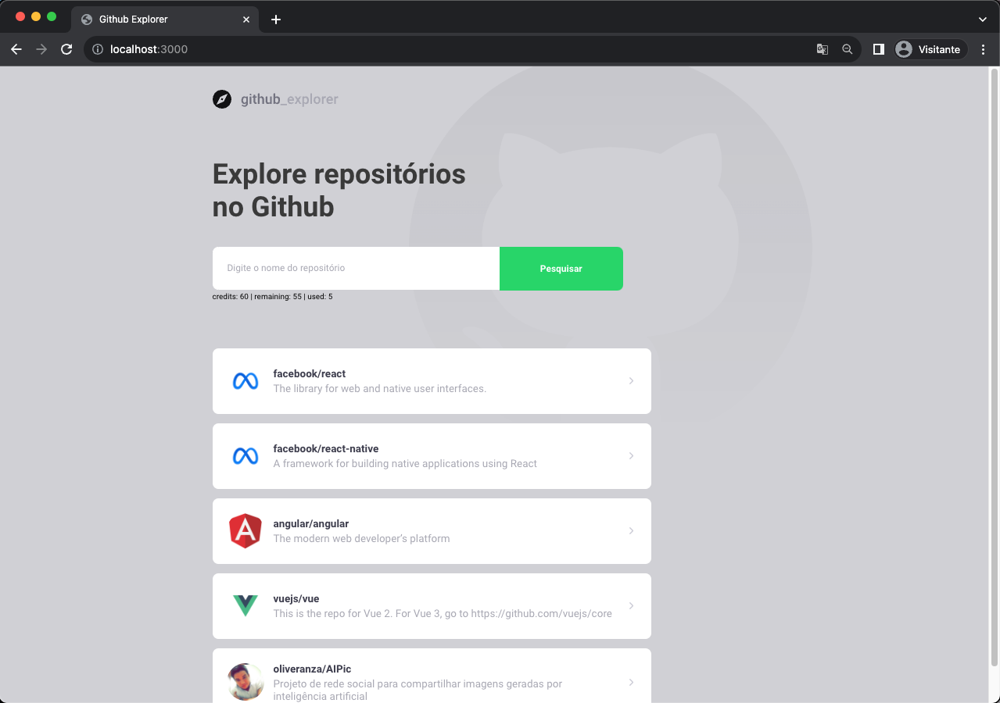
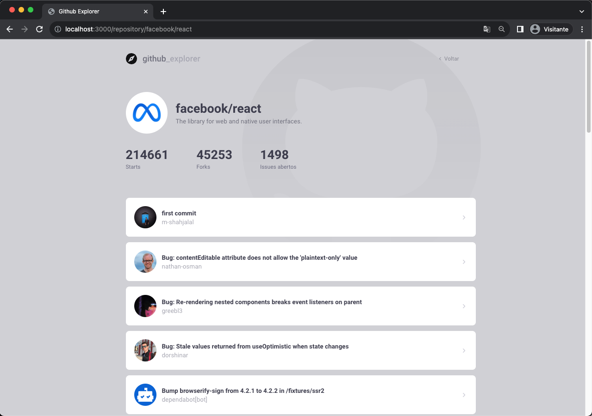

# GitHub Explorer

The GitHub Explorer is a React application that consumes GitHub API and allows users to search and view information about GitHub repositories. The app consists of two main pages: a search page where users can add repositories to the list, and a details page that displays detailed information about the repositories and their issues.

## Screenshots

### `Dashboard page`

*Description: Main page where the users can search for GitHub repositories and add to the list.*

### `Repository Details Page`

*Description: The repository details page can be accessed by clicking on an item in the repositories list. Here are the selected repository issues listed*

## Technologies Used

- TypeScript: The programming language used for static typing.
- Axios: A library used for making HTTP requests to the GitHub API.
- Styled-Components: A library for component styling with CSS-in-JS.
- React Router Dom: Route management for navigation between pages.
- Context API: Used for sharing data between components.

## Installation

1. Clone this repository to your machine:

   ```bash
   git clone https://github.com/oliveranza/github-explorer.git
   ```

2. Navigate to the project directory:

   ```bash
   cd github-explorer
   ```

3. Install the dependencies:

   ```bash
   npm install
   ```

## Usage

To use the GitHub Explorer, follow these steps:

1. Open the app and navigate to the search page.
2. Enter the name of a GitHub repository **(e.g. owner/repository-name)** and add it to the list.
3. Click on a repository in the list to view its details.
4. On the details page, you can see information about the repository, such as stars, forks, and issues as well as the list of issues.
5. Click on a issue in the list to open it on the GitHub website.

## Key Features

    - Add GitHub repositories to the list.
    - View details of repositories, including stars, forks, and issues.
    - List all issues of a repository.
    - Open Issues on GitHub website

## Directory Structure

The project directory structure is organized as follows:

```typescript
github-explorer/
  ├── public/
  ├── screenshots/
  ├── src/
  │    ├── assets/
  │    ├── models/
  │    ├── pages/
  │    │    ├── Dashboard/
  │    │    ├── Repository/
  │    ├── providers/
  │    ├── routes/
  │    ├── services/
  │    ├── styles/
  │    ├── App.tsx
  │    ├── index.tsx
  │    ...
  ├── package.json
  ├── README.md
  └── ...
```

## Available Scripts

In the project directory, you can run:

### `npm start`

Runs the app in the development mode.\
Open [http://localhost:3000](http://localhost:3000) to view it in the browser.

The page will reload if you make edits.\
You will also see any lint errors in the console.

### `npm test`

Launches the test runner in the interactive watch mode.\
See the section about [running tests](https://facebook.github.io/create-react-app/docs/running-tests) for more information.

### `npm run build`

Builds the app for production to the `build` folder.\
It correctly bundles React in production mode and optimizes the build for the best performance.

The build is minified and the filenames include the hashes.\
Your app is ready to be deployed!

See the section about [deployment](https://facebook.github.io/create-react-app/docs/deployment) for more information.

### `npm run eject`

**Note: this is a one-way operation. Once you `eject`, you can’t go back!**

If you aren’t satisfied with the build tool and configuration choices, you can `eject` at any time. This command will remove the single build dependency from your project.

Instead, it will copy all the configuration files and the transitive dependencies (webpack, Babel, ESLint, etc) right into your project so you have full control over them. All of the commands except `eject` will still work, but they will point to the copied scripts so you can tweak them. At this point you’re on your own.

You don’t have to ever use `eject`. The curated feature set is suitable for small and middle deployments, and you shouldn’t feel obligated to use this feature. However we understand that this tool wouldn’t be useful if you couldn’t customize it when you are ready for it.

## Contribution

You can contribute to the GitHub Explorer by opening pull requests or reporting issues. Follow these steps to contribute:

1. Fork the repository.
2. Create a branch for your contribution.
3. Make your changes and submit a pull request.

## Contact

If you have any questions or need to get in touch, you can reach me at

- oliveranza@gmail.com
- [in/evandsonoliveira](https://www.linkedin.com/in/evandsonoliveira/)
